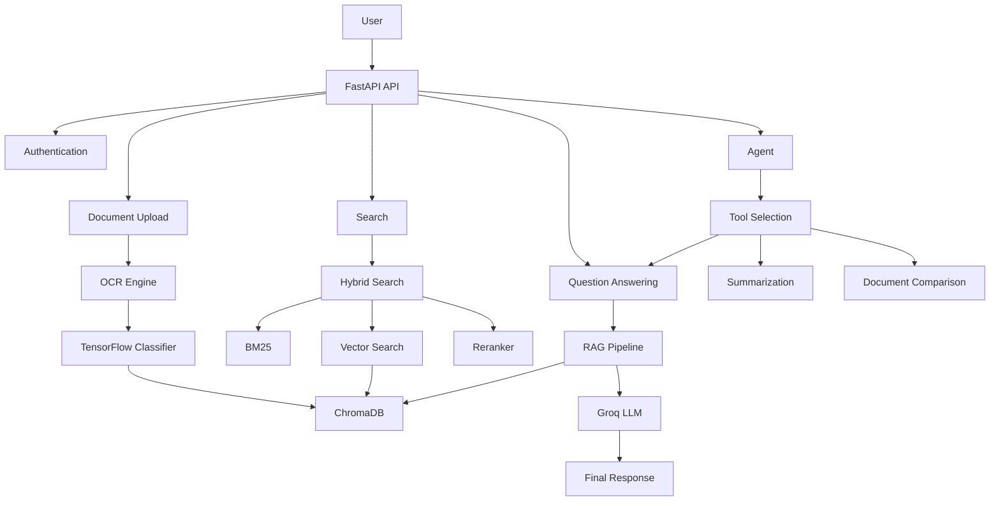
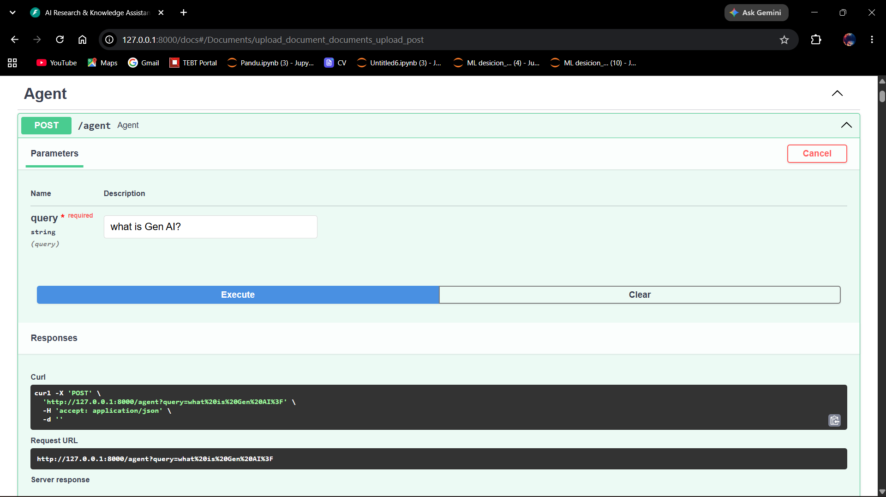

# AI Research & Knowledge Assistant

An AI-powered Research & Knowledge Assistant built using FastAPI, Groq, ChromaDB, TensorFlow, and Retrieval-Augmented Generation (RAG). The application enables users to upload PDF documents, perform intelligent search, ask questions, generate summaries, compare documents, and interact with an Agent-based workflow.

---

## Project Overview

The AI Research & Knowledge Assistant is designed to provide an end-to-end document intelligence platform. Users can upload PDF documents, extract text using OCR, classify documents using TensorFlow, store embeddings in ChromaDB, perform Hybrid Retrieval (BM25 + Semantic Search), and generate contextual responses using Groq LLMs.

The system supports:

- JWT Authentication
- Multi-user Support
- PDF Upload & OCR
- TensorFlow Document Classification
- ChromaDB Vector Database
- Retrieval-Augmented Generation (RAG)
- Hybrid Search (BM25 + Vector Search)
- Cross-Encoder Reranking
- Redis Caching
- Streaming Responses
- Document Summarization
- Document Comparison
- Agent-Based Architecture
- Docker Support
- Unit Testing
- CI/CD Pipeline

---

## Architecture Diagram



---

## Technology Stack

| Component | Technology |
|----------|----------|
| Backend | FastAPI |
| Language | Python 3.11 |
| Database | SQLite |
| Authentication | JWT |
| Vector Database | ChromaDB |
| OCR | Tesseract OCR |
| LLM | Groq |
| ML Framework | TensorFlow |
| Retrieval | BM25 |
| RAG | LangChain |
| Caching | Redis |
| Testing | Pytest |
| Containerization | Docker |
| CI/CD | GitHub Actions |

---

## Features

### Authentication & Access

- User Registration
- User Login
- JWT Authentication
- Multi-user Support

### Document Handling

- PDF Upload
- OCR Support for Scanned PDFs
- TensorFlow Document Classification
- Metadata Storage

### Search & Retrieval

- Semantic Search
- BM25 Search
- Hybrid Search
- ChromaDB Integration
- Cross-Encoder Reranking

### AI Features

- Retrieval-Augmented Generation
- Groq Integration
- Streaming Responses
- Document Summarization
- Document Comparison
- Agent-Based Architecture

### Engineering Features

- Redis Caching
- Docker Support
- Logging
- Rate Limiting
- Background Tasks
- Unit Testing
- CI/CD Pipeline

---

## Project Structure

```text
AI-Research-Knowledge-Assistant/
│
├── .github/
│
├── app/
│   ├── agents/
│   │   ├── compare_agent.py
│   │   ├── graph.py
│   │   ├── qa_agent.py
│   │   ├── summary_agent.py
│   │   └── tools.py
│   │
│   ├── auth/
│   │   ├── dependencies.py
│   │   └── security.py
│   │
│   ├── middleware/
│   │   └── rate_limit.py
│   │
│   ├── models/
│   │   ├── __init__.py
│   │   ├── document.py
│   │   └── user.py
│   │
│   ├── routers/
│   │   ├── __init__.py
│   │   ├── agent.py
│   │   ├── analytics.py
│   │   ├── auth.py
│   │   ├── classify.py
│   │   ├── compare.py
│   │   ├── documents.py
│   │   ├── qa.py
│   │   ├── search.py
│   │   └── summary.py
│   │
│   ├── services/
│   │   ├── __init__.py
│   │   ├── background_tasks.py
│   │   ├── cache_service.py
│   │   ├── classification_service.py
│   │   ├── compare_service.py
│   │   ├── comparison_service.py
│   │   ├── groq_service.py
│   │   ├── hybrid_search.py
│   │   ├── ocr_service.py
│   │   ├── pdf_service.py
│   │   ├── rag_service.py
│   │   ├── reranker.py
│   │   ├── streaming_service.py
│   │   ├── summary_service.py
│   │   └── vector_store.py
│   │
│   ├── tests/
│   │   ├── test_auth.py
│   │   ├── test_documents.py
│   │   ├── test_qa.py
│   │   └── test_search.py
│   │
│   ├── utils/
│   │   ├── __init__.py
│   │   ├── logger.py
│   │   └── text_utils.py
│   │
│   ├── __init__.py
│   ├── config.py
│   ├── database.py
│   ├── main.py
│   ├── ml_saved_model.keras
│   └── schemas.py
│
├── chroma_db/                # ChromaDB vector store (generated at runtime)
├── uploads/                  # Uploaded PDFs (generated at runtime)
├── screenshots/                     # Screenshots demonstrating functionality — TODO: add
├── sample_documents/         # Sample PDFs for testing — TODO: add
│
├── Dockerfile
├── docker-compose.yml
├── .dockerignore
├── .env
├── .env.example
├── .gitignore
├── app.db
├── requirements.txt
├── postman_collection.json   # TODO: add
└── README.md
```

> **Note:** `sample_documents/` and `postman_collection.json` are not yet present in the repository — see [Before Submission](#before-submission) below.

---

## Setup Instructions

### Clone Repository

```bash
git clone https://github.com/<your-username>/AI-Research-Knowledge-Assistant.git

cd AI-Research-Knowledge-Assistant
```

### Create Virtual Environment

```bash
python -m venv .venv
```

### Activate Environment

#### Windows

```bash
.venv\Scripts\activate
```

#### Linux / macOS

```bash
source .venv/bin/activate
```

### Install Dependencies

```bash
pip install -r requirements.txt
```

### Install Tesseract OCR

Download:

- https://github.com/UB-Mannheim/tesseract/wiki

Add Tesseract to PATH.

Example:

```text
C:\Program Files\Tesseract-OCR
```

---

### Install Poppler

Download:

- https://github.com/oschwartz10612/poppler-windows

Add Poppler `bin` folder to PATH.

Example:

```text
C:\poppler\Library\bin
```

---

### Run Application

```bash
uvicorn app.main:app --reload
```

Open Swagger:

```text
http://127.0.0.1:8000/docs
```

---

## Environment Variables

Create a `.env` file:

```env
GROQ_API_KEY=your_groq_api_key

DATABASE_URL=sqlite:///./app.db

CHROMA_DIR=./chroma_db

UPLOAD_DIR=./uploads

SECRET_KEY=your_secret_key

ALGORITHM=HS256

ACCESS_TOKEN_EXPIRE_MINUTES=30
```

---

## API Documentation

| Endpoint | Method | Description |
|--------|--------|--------|
| / | GET | Health Check |
| /auth/register | POST | Register User |
| /auth/login | POST | Login User |
| /documents/upload | POST | Upload PDF |
| /documents | GET | Get Documents |
| /documents/{document_id} | DELETE | Delete Document |
| /search | POST | Semantic Search |
| /qa | POST | Ask Questions |
| /qa/stream | POST | Streaming Response |
| /summary | POST | Document Summarization |
| /compare | POST | Document Comparison |
| /classify | POST | Document Classification (TensorFlow) |
| /agent | POST | Agent-Based Queries |
| /analytics | GET | Analytics / Stats |

### Swagger Documentation

```text
http://127.0.0.1:8000/docs
```

All endpoints can be tested directly from this interactive Swagger UI. A Postman collection (`postman_collection.json`) is also included in the repository for offline testing.

---

## Sample API Requests

### Register

```json
{
    "username": "naru",
    "email": "naru@gmail.com",
    "password": "123"
}
```

### Login

```json
{
    "email": "naru@gmail.com",
    "password": "123"
}
```

Response:

```json
{
    "access_token": "eyJhbGciOiJIUzI1NiIsInR5cCI6IkpXVCJ9...",
    "token_type": "bearer"
}
```

---

### Upload Document

```text
POST /documents/upload
```

Upload:

```text
sample_documents/ai.pdf
```

---

### Search

```json
{
    "query": "what is gen ai?"
}
```

---

### Summary

```json
{
    "document_id": 1,
    "style": "executive"
}
```

---

### Compare

```json
{
    "document_ids": [1, 2],
    "topic": "gen ai"
}
```

---

### Agent

```text
GET /agent?query=what is Gen AI?
```

---

## Assumptions

- Users upload PDF documents.
- Tesseract OCR is installed locally.
- Poppler is installed for OCR processing.
- Redis is optional.
- Groq API Key is available.
- Docker is optional for local development.
- TensorFlow model is trained on a small demonstration dataset.

---

## Design Decisions

### FastAPI

Selected for:

- High Performance
- Asynchronous Support
- Automatic API Documentation

### ChromaDB

Chosen because:

- Lightweight
- Easy Vector Storage
- Supports RAG Workflows

### Groq

Selected due to:

- Fast Inference
- Free Developer Tier
- Easy API Integration

### Hybrid Search

Implemented using:

- BM25
- Semantic Search
- Cross-Encoder Reranking

This improves retrieval quality significantly.

### Agent Architecture

The Agent layer dynamically selects tools based on the user query.

Supported tools:

- Question Answering
- Summarization
- Document Comparison

---

## Screenshots

A quick walkthrough of the API in action, via the Swagger UI (`/docs`).

### Swagger UI Overview


### Root / Health Check

`GET /` confirms the API is running.


### Register

`POST /auth/register` creates a new user account.


### Login

`POST /auth/login` authenticates the user and returns a JWT bearer token.


### Upload Document

`POST /documents/upload` uploads and processes a PDF (OCR + chunking + classification).


### List Documents

`GET /documents` returns all uploaded documents with metadata.


### Delete Document

`DELETE /documents/{document_id}` removes a document by ID.


### Search

`POST /search` performs hybrid (BM25 + vector) semantic search.


### Summary

`POST /summary` generates a document summary via Groq LLM.


### Compare

`POST /compare` compares multiple documents on a given topic.


### Agent

`POST /agent` routes a natural-language query through the agent, which retrieves context and answers with sources.



### Analytics

`GET /analytics` returns aggregate stats across all uploaded documents.


---

## Limitations

- Supports PDF files only.
- TensorFlow model is a demo classifier.
- No cloud deployment.
- Redis is optional.
- Docker requires Docker Desktop.
- Multi-modal document support is not implemented.
- Table extraction is not implemented.
- Full LangGraph workflow is not implemented.

---

## Future Improvements

- DOCX Support
- PPTX Support
- CSV Support
- Image Support
- Table Extraction
- OCR Improvements
- AWS Deployment
- Render Deployment
- Kubernetes Deployment
- Full LangGraph Multi-Agent Workflow
- Production TensorFlow Model
- Metadata-based Retrieval
- Real-time Monitoring

---

## Trained TensorFlow Model

The repository includes:

```text
app/ml_saved_model.keras
```

This model is trained using a small demonstration dataset for assignment purposes.

> Note: For production use, the model should be trained using a larger labeled dataset.

---

## Sample Documents

Sample PDFs are included:

```text
sample_documents/
```

Examples:

- ai.pdf
- ml.pdf
- rag.pdf

---

## Testing

Run tests:

```bash
pytest app/tests
```

---

## Docker Support

Build Docker image:

```bash
docker compose up --build
```

> Note: Docker Desktop with WSL2 is required on Windows.

---

## CI/CD

GitHub Actions workflow can be configured for:

- Automated Testing
- Build Validation
- Deployment Pipelines

---

## Before Submission

The following still need to be added to the repository before it's submission-ready:

- [ ] **`sample_documents/`** — add sample PDFs (e.g. `ai.pdf`, `ml.pdf`, `rag.pdf`) for testing upload/search/summary/compare
- [ ] **`postman_collection.json`** — export a Postman collection, or remove this line from the checklist below and rely on Swagger only
- [ ] A screenshot of `/classify` is not yet included in `screenshots/` — add one if possible

Everything else (source code, model, README, API docs, Swagger, screenshots) is already in place.

---

## Submission Checklist

| Requirement | Status |
|---|---|
| Complete Source Code | ✅ Present (`app/`) |
| Public GitHub Repository | ✅ |
| README Documentation | ✅ This file |
| Trained TensorFlow Model | ✅ `app/ml_saved_model.keras` |
| Sample Documents | ⬜ Not yet added — see [Before Submission](#before-submission) |
| API Documentation | ✅ [API Documentation](#api-documentation) section |
| Screenshots | ✅ `screenshots/` folder |
| Postman Collection | ⬜ Not yet added — optional if Swagger is sufficient |
| Swagger Documentation | ✅ Available at `/docs` |

---

## Author

### Narendra Sonawane

- GitHub: https://github.com/<your-username>
- LinkedIn: https://linkedin.com/in/<your-linkedin>

---

## License

This project is submitted as part of the Sequelstring Solutions & Consultancy Pvt Ltd AI Engineering Assignment.
