# AI Research & Knowledge Assistant

## Project Overview

AI Research & Knowledge Assistant is a FastAPI-based application designed to help users upload, analyze, search, and query documents using Generative AI techniques.

The system combines OCR, Retrieval-Augmented Generation (RAG), Hybrid Search (BM25 + Vector Search), ChromaDB, and Groq LLMs to provide intelligent responses from uploaded documents.

The application also supports JWT authentication, multi-user access, document summarization, document comparison, streaming responses, caching, and an agent-based architecture.

---

## Architecture Diagram

```text
                +----------------+
                |     User       |
                +--------+-------+
                         |
                         v
                +----------------+
                |   FastAPI API  |
                +--------+-------+
                         |
      +------------------+-------------------+
      |                  |                   |
      v                  v                   v
+------------+    +-------------+     +--------------+
| Auth Layer |    | Upload API  |     | Search API   |
+------------+    +-------------+     +--------------+
                         |
                         v
                +------------------+
                | PDF + OCR Engine |
                +------------------+
                         |
                         v
                +------------------+
                | Classification   |
                | (TensorFlow)     |
                +------------------+
                         |
                         v
                +------------------+
                | ChromaDB         |
                | Vector Store     |
                +------------------+
                         |
                         v
                +------------------+
                | Hybrid Retrieval |
                | BM25 + Semantic  |
                +------------------+
                         |
                         v
                +------------------+
                | Reranker         |
                +------------------+
                         |
                         v
                +------------------+
                | RAG Pipeline     |
                +------------------+
                         |
                         v
                +------------------+
                | Groq LLM         |
                +------------------+
                         |
                         v
                +------------------+
                | Final Response   |
                +------------------+
```

---

## Technology Stack

| Component | Technology |
|----------|------------|
| Backend | FastAPI |
| Language | Python 3.11 |
| Database | SQLite |
| Vector Database | ChromaDB |
| Authentication | JWT |
| LLM | Groq |
| OCR | Tesseract OCR |
| ML Framework | TensorFlow |
| Retrieval | BM25 |
| RAG | LangChain |
| Caching | Redis |
| Testing | Pytest |
| Containerization | Docker |
| CI/CD | GitHub Actions |

---

## Setup Instructions

### Clone Repository

```bash
git clone https://github.com/Narendra-Sonawane7/AI--Research-Knowledge_Assistant.git

cd AI-Research-Knowledge-Assistant
```

### Create Virtual Environment

```bash
python -m venv .venv
```

### Activate Environment

#### Windows

```bash
.venv\Scripts\activate
```

### Install Dependencies

```bash
pip install -r requirements.txt
```

### Run Application

```bash
uvicorn app.main:app --reload
```

Open:

```text
http://127.0.0.1:8000/docs
```

---

## Environment Variables

Create a `.env` file:

```env
GROQ_API_KEY=your_groq_api_key

DATABASE_URL=sqlite:///./app.db

CHROMA_DIR=./chroma_db

UPLOAD_DIR=./uploads

SECRET_KEY=your_secret_key

ALGORITHM=HS256

ACCESS_TOKEN_EXPIRE_MINUTES=30
```

---

## API Documentation

| Endpoint | Method | Description |
|--------|--------|------------|
| / | GET | Health Check |
| /auth/register | POST | Register User |
| /auth/login | POST | Login User |
| /documents/upload | POST | Upload PDF |
| /documents | GET | List Documents |
| /documents/{document_id} | DELETE | Delete Document |
| /search | POST | Semantic Search |
| /qa | POST | Ask Questions |
| /qa/stream | POST | Streaming Responses |
| /summary | POST | Document Summarization |
| /compare | POST | Document Comparison |
| /agent | POST | Agent-Based Queries |
| /analytics | GET | Analytics / Stats |

Swagger Documentation:

```text
http://127.0.0.1:8000/docs
```

---

## Screenshots

A quick walkthrough of the API in action, via the Swagger UI (`/docs`).

### Swagger UI Overview

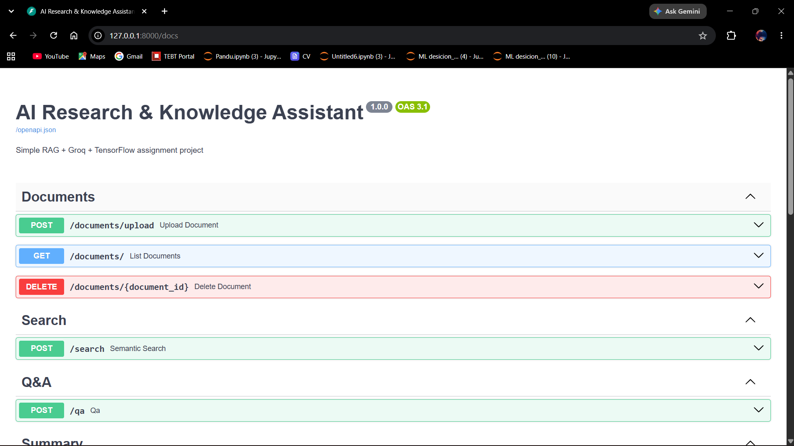

### Root / Health Check

`GET /` confirms the API is running:

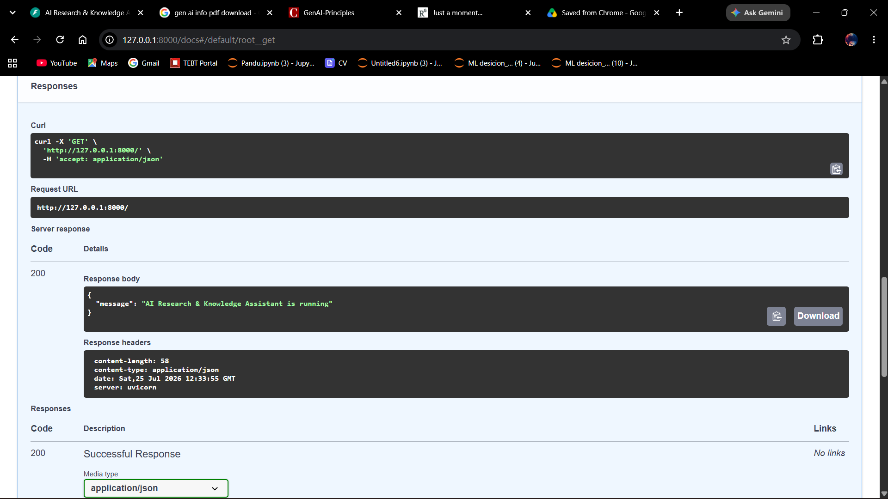

### Agent-Based Query

`POST /agent` routes a natural-language query through the agent, which retrieves context and answers with sources:


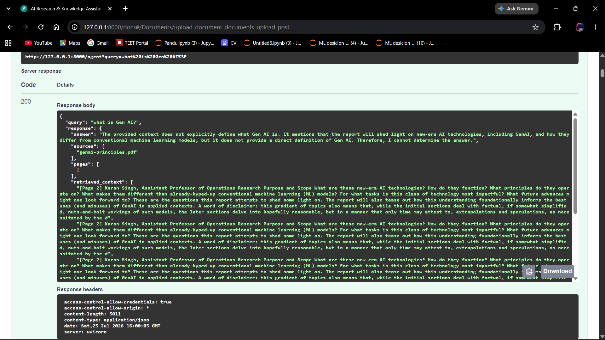

### Upload Document

Uploading a PDF (`multipart/form-data`) to `/documents/upload`:

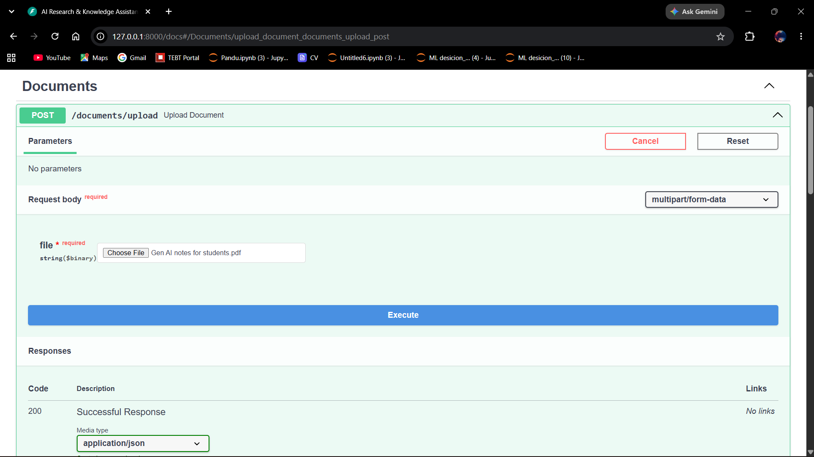

Response after processing — document is chunked, OCR'd, and classified:

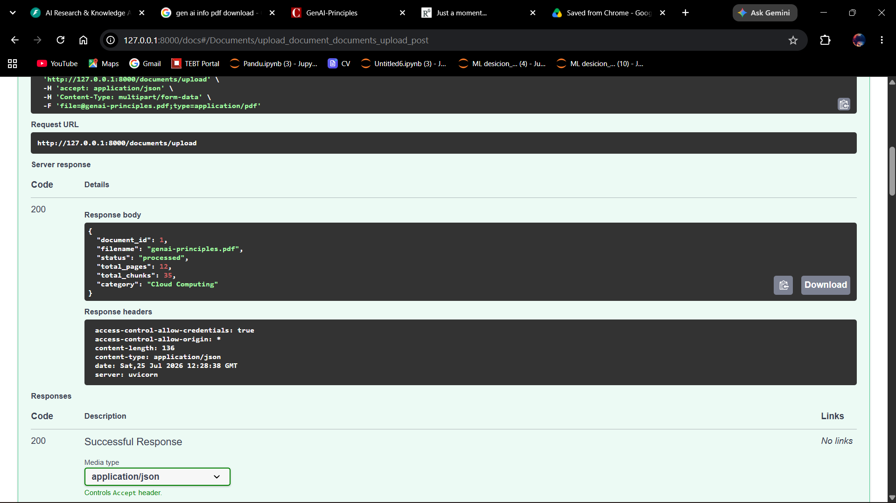

### List Documents

`GET /documents/` returns all uploaded documents with metadata:

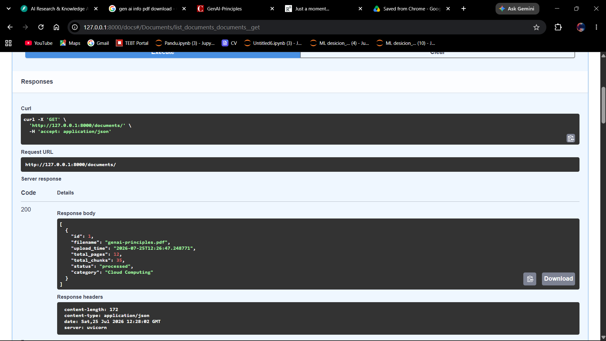

### Delete Document

`DELETE /documents/{document_id}` removes a document by ID:

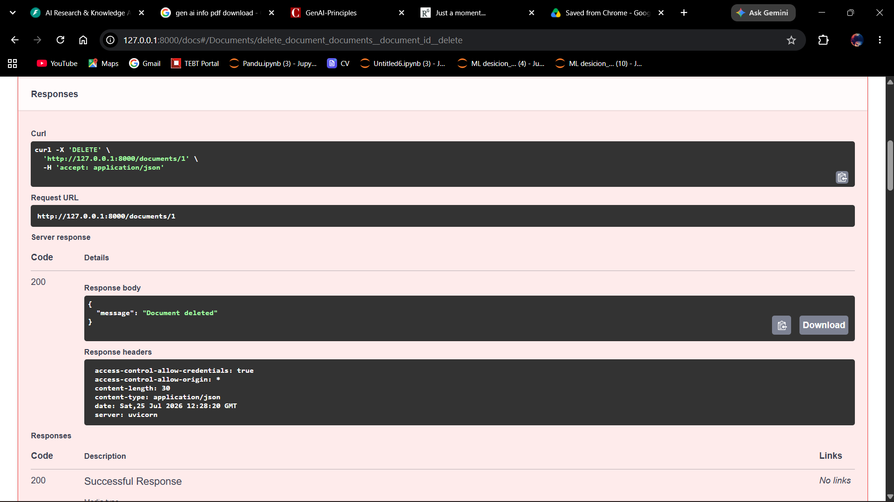

### Semantic Search

`POST /search` performs hybrid (BM25 + vector) semantic search over uploaded documents:

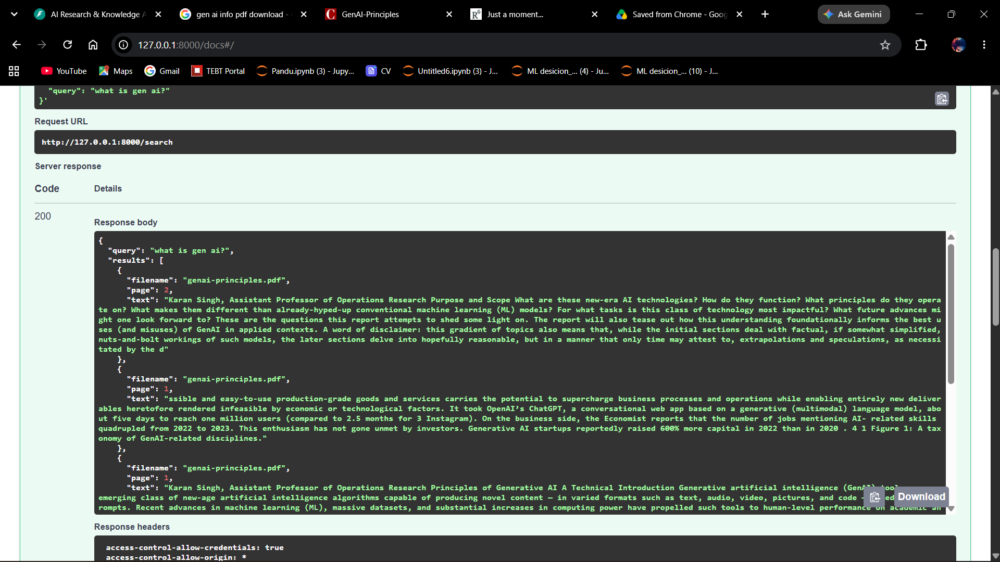

### Document Summarization

`POST /summary` generates an executive/technical/bullet-point summary via Groq LLM:

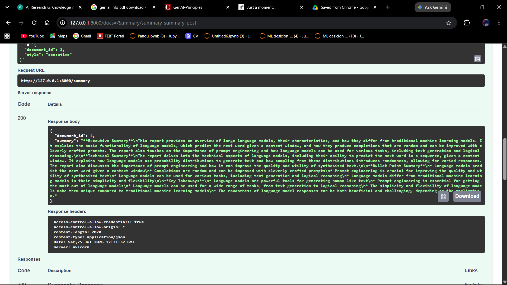

### Document Comparison

`POST /compare` compares multiple documents on a given topic:

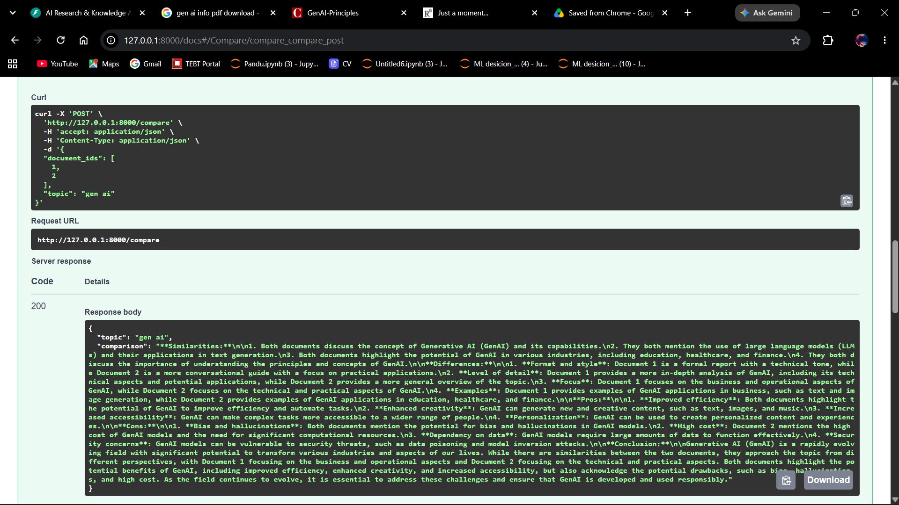

### Analytics

`GET /analytics` returns aggregate stats across all uploaded documents:

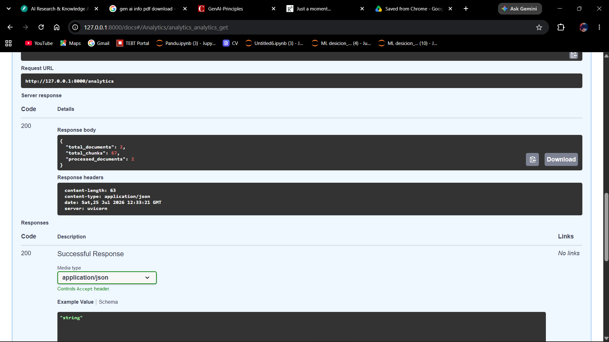

---

## Assumptions

- Users upload PDF documents.
- Groq API key is available.
- Tesseract OCR is installed locally.
- Poppler is installed for scanned PDFs.
- Redis is optional and the application should function without it.
- The TensorFlow classifier is a demonstration model and not trained on a production dataset.

---

## Design Decisions

### FastAPI

Chosen for its performance, asynchronous capabilities, and automatic Swagger documentation.

### ChromaDB

Selected for lightweight vector storage and easy integration with RAG pipelines.

### Groq

Used due to its fast inference speed and free developer tier.

### Hybrid Search

Implemented using:

- BM25
- Semantic Search
- Cross-Encoder Reranking

to improve retrieval quality.

### Agent Architecture

Implemented to demonstrate:

- Tool Selection
- Task Orchestration
- Agentic AI Concepts

---

## Limitations

- Supports only PDF documents.
- TensorFlow model uses a dummy dataset.
- Redis caching is optional.
- No cloud deployment in the current implementation.
- Docker requires Docker Desktop and WSL2.
- Multi-modal support (DOCX, PPTX, Images) is not implemented.

---

## Future Improvements

- DOCX Support
- PPTX Support
- CSV Support
- Image Support
- Table Extraction
- AWS Deployment
- Render Deployment
- Full LangGraph Multi-Agent Workflow
- Metadata-based Retrieval
- Production-grade TensorFlow Model
- Real-time Monitoring
- Kubernetes Deployment

---

## Features

- JWT Authentication
- Multi-user Support
- PDF Upload
- OCR Support
- TensorFlow Classification
- ChromaDB Integration
- Retrieval-Augmented Generation
- Hybrid Search
- Cross-Encoder Reranking
- Groq LLM Integration
- Streaming Responses
- Redis Caching
- Agent-Based Architecture
- Logging
- Rate Limiting
- Background Tasks
- Docker Support
- Unit Testing
- CI/CD Pipeline

---

## Author

**Narendra Sonawane**

- LinkedIn: https://linkedin.com/in/<your-profile>
- GitHub: https://github.com/<your-username>
